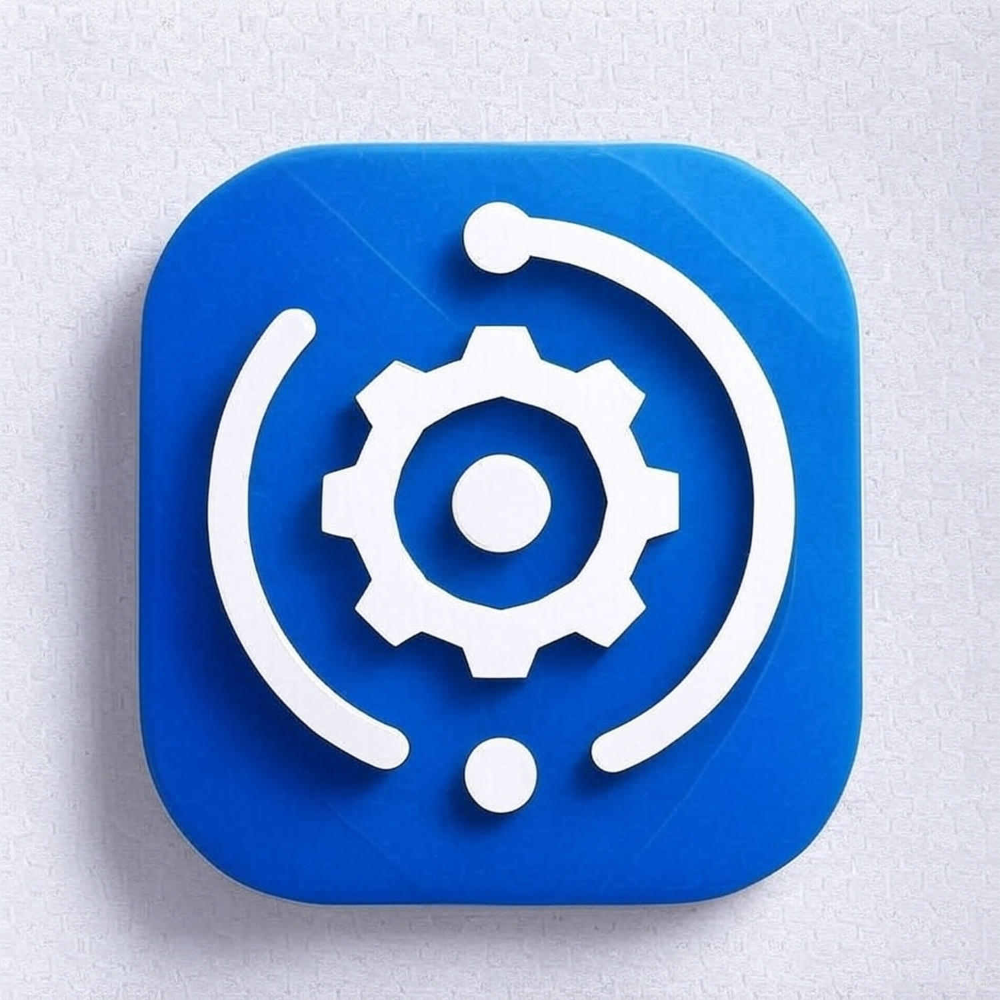

# Flex Flow

<p align="center">
  
</p>

## Introduction

This is a simple tool that allow you can manage the task flow by remote or in local.  
***Warning: DO NOT RUN THIS PROGRAM AS SUPER USER AND ADMINISTRATOR, OR IT WILL CAUSE CRITICAL SECURITY ISSUES.***

## Supported OS (Others are not tested yet)
- Windows 11 x86_64 or later with UTF-8 enabled
- Arch Linux
- Mac OS with Apple silicon

## How to build

### Build dependency

- common
  - [Task file](https://taskfile.dev)
  - [CMake](https://cmake.org)
  - [Git](https://git-scm.com)
- Protobuf
  - [Buf](https://buf.build)
- Model
  - C++ 20
  - Protobuf
  - [SQLite](https://www.sqlite.org)
  - [gRPC](https://grpc.io)
  - [spdlog](https://github.com/gabime/spdlog)
- Webui
  - [pnpm](https://pnpm.io)
- Server
  - Model
  - [cxxopts](https://github.com/jarro2783/cxxopts)
  - [yaml-cpp](https://github.com/jbeder/yaml-cpp)
- GUI
  - Model with C API
  - WebUI
  - [tauri](https://tauri.app)

### Environment variable for build

- Use ```.env``` in the root of the project
- Please refer to ```.env.default``` for details

### Build command

- ```task build-cpp```: to build model and grpc server
- ```task build-gui```: to build desktop gui
- ```task dev-gui```: to develop desktop gui
- ```task clean```: to clean build

## License

[MIT](https://opensource.org/licenses/MIT)
